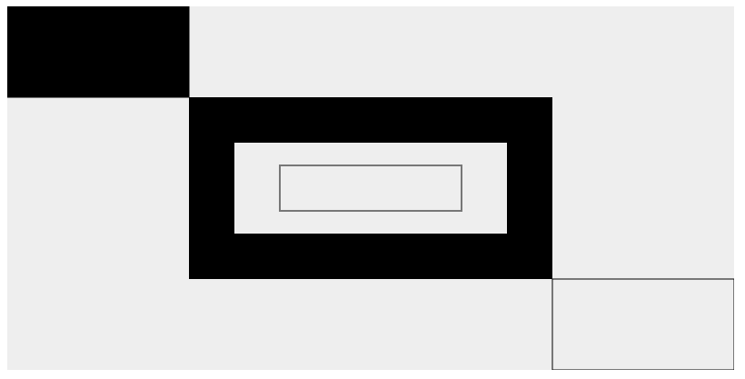

@[TOC]目录

+ [基本用法](#基本用法)  
    + [canvas用法](#canvas用法)  
    + [渲染上下文](#渲染上下文)  
    + [检查支持项](#检查支持项)  
+ [绘制图形](#绘制图形)  
    + [绘制矩形方法](#绘制矩形方法)  
    + [绘制路径和线](#绘制路径和线)  
    + [圆弧](#圆弧)  
    + [二次贝塞尔曲线及三次贝塞尔曲线](#二次贝塞尔曲线及三次贝塞尔曲线)  
    + [Path2D对象](#Path2D对象)  
+ [添加样式和颜色](#添加样式和颜色)  
    + [色彩Color](#色彩Color)  
    + [透明度](#透明度)  
    + [线型LineStyle](#线型LineStyle)  
    + [渐变](#渐变)  
    + [图案样式](#图案样式)  
    + [阴影](#阴影)  
    + [Canvas填充规则](#Canvas填充规则)  
+ [绘制文本](#绘制文本)  
    + [样式](#样式)  
## 基本用法
#### canvas用法
```
    <canvas id="canvas" width="150" height="150"></canvas>
```
<canvas> 标签只有两个属性—— width和height。这些都是可选的，并且同样利用 DOM properties 来设置。当没有设置宽度和高度的时候，canvas会初始化宽度为300像素和高度为150像素。该元素可以使用CSS来定义大小，但在绘制时图像会伸缩以适应它的框架尺寸：如果CSS的尺寸与初始画布的比例不一致，它会出现扭曲。  
>__注意__: 如果你绘制出来的图像是扭曲的, 尝试用width和height属性为<canvas>明确规定宽高，而不是使用CSS。  
#### 渲染上下文
<canvas> 元素创造了一个固定大小的画布，它公开了一个或多个渲染上下文，其可以用来绘制和处理要展示的内容。我们将会将注意力放在2D渲染上下文中。其他种类的上下文也许提供了不同种类的渲染方式；比如， WebGL 使用了基于OpenGL ES的3D上下文 ("experimental-webgl") 。  
canvas起初是空白的。为了展示，首先脚本需要找到渲染上下文，然后在它的上面绘制。<canvas> 元素有一个叫做 getContext() 的方法，这个方法是用来获得渲染上下文和它的绘画功能。getContext()只有一个参数，上下文的格式。对于2D图像而言，如本教程，你可以使用 CanvasRenderingContext2D。  
```
    var canvas = document.getElementById("canvas");
    var ctx = canvas.getContext("2d");
```
代码的第一行通过使用 document.getElementById() 方法来为 <canvas> 元素得到DOM对象。一旦有了元素对象，你可以通过使用它的getContext() 方法来访问绘画上下文。  
#### 检查支持项
替换内容是用于在不支持 <canvas> 标签的浏览器中展示的。通过简单的测试getContext()方法的存在，脚本可以检查编程支持性。上面的代码片段现在变成了这个样子：  
```
    var canvas = document.getElementById("canvas");
    if (canvas.getContext) {
        var ctx = canvas.getContext("2d");
    } else {
        \\
    }
```

## 绘制图形
如何在canvas上绘制三角形、直线、圆弧和曲线。须知左上角为原点坐标，所有元素的位置都相对于原点定位。  
#### 绘制矩形方法
```
    rect(x, y, width, height) // 绘制一个矩形
    fillRect(x, y, width, height) // 绘制一个填充矩形
    strokeRect(x, y, width, height) // 绘制一个矩形的边框
    clearRect(x, y, width, height) // 清楚指定矩形区域，让清除部分完全透明
```
矩形例子
```
    function draw() {
        var canvas = document.getElementById("canvas");
        if (canvas.getContext) {
            var ctx = canvas.getContext("2d");
            // 绘制一个起点在(25, 25)位置宽100，高100的矩形
            ctx.fillRect(25, 25, 100, 100);
            // 清除一个起点在(45, 45)位置宽60，高60的矩形
            ctx.clearRect(45, 45, 60, 60);
            // 绘制一个起点在(50, 50)位置宽50，高50的矩形边框
            ctx.strokeRect(50, 50, 50, 50);
        }
    }
```
#### 绘制路径和线
图形的基本元素是路径。路径是通过不同颜色和宽度的线段或曲线相连形成的不同形状的点的集合。一个路径，甚至一个子路径，都是闭合的。使用路径绘制图形需要额外的步骤。  
    1.首先，你需要创建路径起始点。  
    2.然后你使用画图命令去画出路径。  
    3.之后闭合路径。  
    4.生成路径后，你可以通过通过描边或填充来渲染图形。  
一下是用到的函数：  
```
    beginPath() // 新建一条路径的起点
    closePath() // 闭合路径，绘制命令重新指向上下文

    moveTo(x, y) // 将画笔移动到指定的(x, y)位置
    lineTo(x, y) // 绘制一条直线从当前位置到(x, y)位置

    stroke() // 绘制轮廓
    fill() // 绘制填充
```
__示例__
```
    const canvas = document.getElementById("canvas");
    const cxt = canvas.getContext("2d");
    cxt.fillRect(200, 100, 400, 200);
    cxt.clearRect(250, 150, 300, 100);
    cxt.strokeRect(300, 175, 200, 50);

    cxt.fillStyle = "#000000";
    cxt.rect(0, 0, 200, 100);
    cxt.fill();

    cxt.strokeStyle = "#000000";
    cxt.rect(600, 300, 200, 100);
    cxt.stroke();
```


> __注意__：当前路径为空，即调用beginPath()之后，或者canvas刚建的时候，第一条路径构造命令通常被视为是moveTo（），无论实际上是什么。出于这个原因，你几乎总是要在设置路径之后专门指定你的起始位置。  

> __注意__：当你调用fill()函数时，所有没有闭合的形状都会自动闭合，所以你不需要调用closePath()函数。但是调用stroke()时不会自动闭合。  
#### 圆弧
绘制圆弧或者圆，我们使用arc()方法。当然可以使用arcTo()，不过这个的实现并不是那么的可靠，所以我们这里不作介绍。  
```
    // (x, y)为圆心位置,radius为半径，startAngle和endAngle为开始和结束弧度，
    // anticlockwise为绘制圆弧的方向
    arc(x, y, radius, startAngle, endAngle, anticlockwise)

    // (x1, y1)第一个控制点，(x2, y2)第二个控制点，radius半径
    arcTo(x1, y1, x2, y2, radius)
```
> 注意：arc()函数中表示角的单位是弧度，不是角度。角度与弧度的js表达式: 弧度=(Math.PI/180)*角度。  
#### 二次贝塞尔曲线及三次贝塞尔曲线
```
    // 绘制二次贝塞尔曲线，cp1x,cp1y为一个控制点，x,y为结束点。
    quadraticCurveTo(cp1x, cp1y, x, y)

    // 绘制三次贝塞尔曲线，cp1x,cp1y为控制点一，cp2x,cp2y为控制点二，x,y为结束点。
    bezierCurveTo(cp1x, cp1y, cp2x, cp2y, x, y)
```
#### Path2D对象
__Path2D__  
    Path2D()会返回一个新初始化的Path2D对象（可能将某一个路径作为变量——创建一个它的副本，或者将一个包含SVG path数据的字符串作为变量）。  
```
    new Path2D();     // 空的Path对象
    new Path2D(path); // 克隆Path对象
    new Path2D(d);    // 从SVG建立Path对象
```
所有的路径方法比如moveTo, rect, arc或quadraticCurveTo等，如我们前面见过的，都可以在Path2D中使用。  
Path2D API 添加了 addPath作为将path结合起来的方法。当你想要从几个元素中来创建对象时，这将会很实用。比如：  
__Path2D.addPath(path [, transform])​__  
添加了一条路径到当前路径（可能添加了一个变换矩阵）。  
__使用 SVG paths__  
```
    var p = new Path2D("M10 10 h 80 v 80 h -80 Z");
```

## 添加样式和颜色
#### 色彩Color
如果想要给图形上色，有两个重要的属性可以做到：  
__fillStyle = collor__ 设置图形的填充颜色  
__strokeStyle = collor__ 设置图形轮廓的颜色  
> __注意:__ 一旦您设置了 strokeStyle 或者 fillStyle 的值，那么这个新值就会成为新绘制的图形的默认值。如果你要给每个图形上不同的颜色，你需要重新设置 fillStyle 或 strokeStyle 的值。  
#### 透明度
__globalAlpha = value__  
这个属性影响到 canvas 里所有图形的透明度，有效的值范围是 0.0 （完全透明）到 1.0（完全不透明），默认是 1.0。  
#### 线型LineStyle
__lineWidth = value__ 设置线条宽度  
__lineCap = type__ 设置线末端样式  
```
ctx.lineCap = "butt"; // 线段末端以方形结束
ctx.lineCap = "round"; // 线段末端以圆形结束
ctx.lineCap = "square"; // 线段末端以方形结束，但是增加了一个宽度和线段相同，高度是线段厚度一半的矩形区域
```
__lineJoin = type__ 设置线条与线条结合处的样式  
```
// 在相连部分的末端填充一个额外的以三角形为底的区域， 每个部分都有各自独立的矩形拐角
ctx.lineJoin = "bevel";
// 通过填充一个额外的，圆心在相连部分末端的扇形，绘制拐角的形状。 圆角的半径是线段的宽度
ctx.lineJoin = "round";
// 通过延伸相连部分的外边缘，使其相交于一点，形成一个额外的菱形区域
ctx.lineJoin = "miter";
```
__miterLimit = value__ 限制当两条线相交时交接处最大长度；所谓交接处长度（斜接长度）是指线条交接处内角顶点到外角顶点的长度  
__getLineDash()__ 返回一个包含当前虚线样式，长度为非负偶数的数组  
__setLineDash(segments)__ 设置当前虚线样式
__lineDashOffset = value__ 设置虚线样式的起始偏移量
#### 渐变
__createLinearGradient(x1, y1, x2, y2)__  
createLinearGradient 方法接受 4 个参数，表示渐变的起点 (x1,y1) 与终点 (x2,y2)  
__createRadialGradient(x1, y1, r1, x2, y2, r2)__  
createRadialGradient 方法接受 6 个参数，前三个定义一个以 (x1,y1) 为原点，半径为 r1 的圆，后三个参数则定义另一个以 (x2,y2) 为原点，半径为 r2 的圆。  
```
var lineargradient = ctx.createLinearGradient(0,0,150,150);
var radialgradient = ctx.createRadialGradient(75,75,0,75,75,100);
```
创建出 canvasGradient 对象后，我们就可以用 addColorStop 方法给它上色了。  
__gradient.addColorStop(position, color)__  
addColorStop 方法接受 2 个参数，position 参数必须是一个 0.0 与 1.0 之间的数值，表示渐变中颜色所在的相对位置。例如，0.5 表示颜色会出现在正中间。color 参数必须是一个有效的 CSS 颜色值（如 #FFF， rgba(0,0,0,1)，等等）  
#### 图案样式
__createPattern(image, type)__  
该方法接受两个参数。Image 可以是一个 Image 对象的引用，或者另一个 canvas 对象。Type 必须是下面的字符串值之一：repeat，repeat-x，repeat-y 和 no-repeat  
```
var img = new Image();
img.src = 'someimage.png';
var ptrn = ctx.createPattern(img,'repeat');
```
#### 阴影
__shadowOffsetX = float__  
shadowOffsetX 和 shadowOffsetY 用来设定阴影在 X 和 Y 轴的延伸距离，它们是不受变换矩阵所影响的。负值表示阴影会往上或左延伸，正值则表示会往下或右延伸，它们默认都为 0。  
__shadowOffsetY = float__  
shadowOffsetX 和 shadowOffsetY 用来设定阴影在 X 和 Y 轴的延伸距离，它们是不受变换矩阵所影响的。负值表示阴影会往上或左延伸，正值则表示会往下或右延伸，它们默认都为 0。  
__shadowBlur = float__  
shadowBlur 用于设定阴影的模糊程度，其数值并不跟像素数量挂钩，也不受变换矩阵的影响，默认为 0。  
__shadowColor = color__  
shadowColor 是标准的 CSS 颜色值，用于设定阴影颜色效果，默认是全透明的黑色。  
#### Canvas填充规则
__ctx.fill(value)__  
两个可能的值：  
+ nonzero：默认值
+ evenodd：奇偶环绕规则

## 绘制文本
canvas提供了两个绘制文本的方法分别是  
```
// 指定文本内容text, 位置(x, y), 最大宽度maxWidth(可选)
fillText(text, x, y, maxWidth)
//
strokeText(text, x, y, maxWidth)
```
#### 样式
__font = value__  
__textAligin = value__ 文本对齐选项,可选值start, end, left, right or center. 默认值是 start  
__textBaseline = value__ 基线对齐选项,可选值top, hanging, middle, alphabetic, ideographic, bottom。默认值是 alphabetic  
__direction = value__ 文本方向,可选值ltr, rtl, inherit。默认值是 inherit  